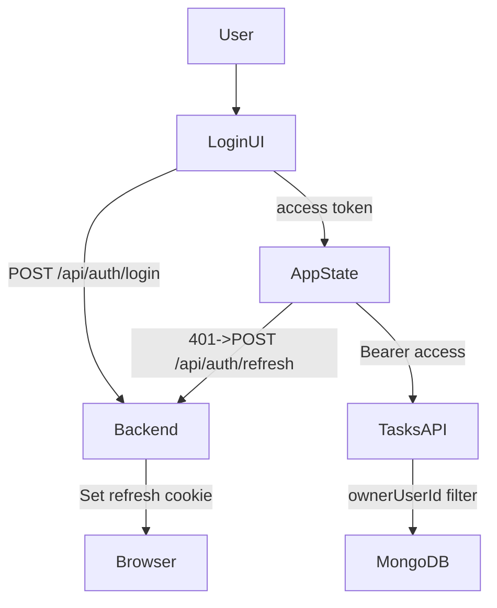

# Auth + user session (JWT) + per-user tasks

## Decisions (confirmed)

- **Auth method**: JWT
- **Credentials**: username + password

## High-level approach

- Use **short-lived access token** (JWT) + **long-lived refresh token** stored in an **httpOnly cookie**.
  - Access token returned in JSON and stored in memory on the client.
  - Refresh token cookie used to silently renew access token.
- Protect task routes with `requireAuth` middleware.
- Add `ownerUserId` to `Task` model and always filter by it.

## Backend changes

### Dependencies

- Add to `backend/`:
  - `jsonwebtoken`
  - `bcryptjs`
  - `cookie-parser`
  - (optional) `zod` (skip unless you want stronger validation)

### Env vars

- Extend `backend/.env.example`:
  - `JWT_ACCESS_SECRET=...`
  - `JWT_REFRESH_SECRET=...`
  - `JWT_ACCESS_TTL_SECONDS=900` (15m)
  - `JWT_REFRESH_TTL_DAYS=30`
  - `COOKIE_SECURE=false` (true in production)

### User model

- Add `[backend/src/models/User.ts](backend/src/models/User.ts)`:
  - `username` (unique, required)
  - `passwordHash` (required)
  - `refreshTokenHash` (optional) — store hash so refresh tokens can be revoked
  - timestamps

### Auth routes

- Add `[backend/src/routes/auth.ts](backend/src/routes/auth.ts)` mounted at `/api/auth`:
  - `POST /api/auth/register` — create user (hash password)
  - `POST /api/auth/login` — verify password, issue access token + set refresh cookie
  - `POST /api/auth/refresh` — rotate refresh token, return new access token
  - `POST /api/auth/logout` — clear refresh cookie + remove stored refreshTokenHash
  - `GET /api/auth/me` — return current user info (requires access token)

### JWT helpers + middleware

- Add:
  - `[backend/src/auth/jwt.ts](backend/src/auth/jwt.ts)` for sign/verify helpers
  - `[backend/src/middleware/requireAuth.ts](backend/src/middleware/requireAuth.ts)`:
    - Reads `Authorization: Bearer <access>`
    - Verifies JWT
    - Attaches `req.user = { userId, username }`

### Task ownership

- Update `[backend/src/models/Task.ts](backend/src/models/Task.ts)`:
  - Add `ownerUserId: ObjectId` (required, indexed)
- Update `[backend/src/routes/tasks.ts](backend/src/routes/tasks.ts)`:
  - All routes require `requireAuth`
  - `GET /api/tasks` filters by `{ ownerUserId: req.user.userId }`
  - `POST /api/tasks` sets `ownerUserId` from `req.user.userId`
  - `GET/PATCH/DELETE /api/tasks/:id` only operate on tasks owned by that user

### Categories endpoint

- Keep `/api/task-categories` public (or protect it—either way is fine). No DB changes.

### Server wiring

- Update `[backend/src/server.ts](backend/src/server.ts)`:
  - `app.use(cookieParser())`
  - mount `authRouter`
  - mount `tasksRouter` (now protected internally)
  - CORS: enable `credentials: true` so refresh cookie works

## Frontend changes

### Auth state

- Add minimal auth store (React state + helpers) in:
  - `[src/auth/useAuth.ts](src/auth/useAuth.ts)` (or `src/auth/AuthContext.tsx`)
- Implement functions:
  - `login(username, password)`
  - `register(username, password)`
  - `logout()`
  - `refresh()`
  - `authFetch()` wrapper that:
    - adds `Authorization` header
    - on 401 tries `/api/auth/refresh` then retries once

### UI

- Add pages/components:
  - `[src/pages/Login.tsx](src/pages/Login.tsx)`
  - Optional `[src/pages/Register.tsx](src/pages/Register.tsx)`
- Update `[src/App.tsx](src/App.tsx)`:
  - Gate Tasks screen behind auth
  - If not authenticated, show Login
- Update `[src/pages/Tasks.tsx](src/pages/Tasks.tsx)`:
  - Use `authFetch` for `/api/tasks` and `/api/task-categories`
  - Add a Logout button

## Data flow

## Verification

- Backend:
  - Register/login returns access token and sets refresh cookie
  - Refresh rotates tokens
  - Logout revokes refresh
  - Task CRUD only returns user-owned tasks
- Frontend:
  - Login → Tasks works
  - Refresh works after access expiry (manual test)
  - Logout clears session

