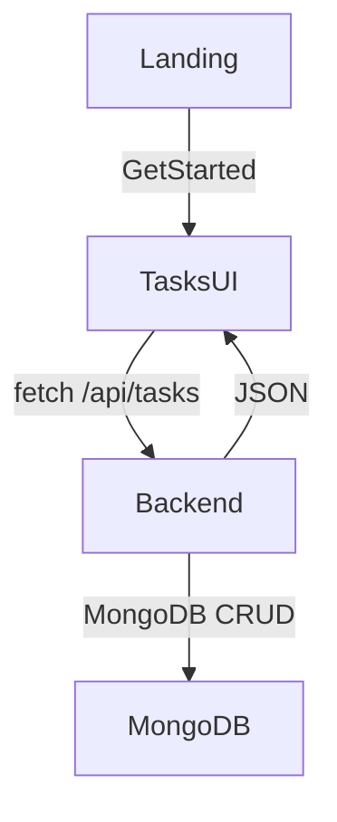

# Task CRUD (basic) — backend + frontend

## Scope (as confirmed)

- **Fullstack**: backend REST API + basic frontend UI.
- **Basic CRUD only**: create/read/update/delete tasks (no completion history, no next-due calculations yet).

## Data model (MongoDB)

- Create a `Task` collection with fields:
  - `title` (required)
  - `description` (optional)
  - `category` (optional)
  - `frequencyUnit` (`weekly` | `monthly` | `yearly`, optional for now)
  - `frequencyInterval` (number, optional for now)
  - `active` (boolean, default `true`)
  - timestamps (`createdAt`, `updatedAt`)

## Backend changes (Express)

- Add files:
  - `[backend/src/models/Task.ts](backend/src/models/Task.ts)`: Mongoose schema + model
  - `[backend/src/routes/tasks.ts](backend/src/routes/tasks.ts)`: CRUD routes mounted at `/api/tasks`
- Update `[backend/src/server.ts](backend/src/server.ts)` to mount the router:
  - Keep existing `GET /api/health`
  - Add `app.use('/api/tasks', tasksRouter)`
  - Add small JSON error handler for validation errors / bad ObjectIds

### REST endpoints

- `GET /api/tasks` → list tasks (optionally support `?active=true|false` and `?category=...`)
- `POST /api/tasks` → create task
- `GET /api/tasks/:id` → fetch one
- `PATCH /api/tasks/:id` → update (partial)
- `DELETE /api/tasks/:id` → delete

### Validation approach

- Keep dependencies minimal: do **manual validation** on `req.body` (required `title`, optional strings, interval number must be positive if provided).

## Frontend changes (React)

- Add a basic Tasks view and simple navigation **without adding a router dependency**.
- New files:
  - `[src/pages/Tasks.tsx](src/pages/Tasks.tsx)`: list + create form + inline edit/delete
  - `[src/pages/tasks.css](src/pages/tasks.css)`: styling consistent with existing theme variables
- Update:
  - `[src/App.tsx](src/App.tsx)`: switch between `Landing` and `Tasks` using local state
  - `[src/pages/Landing.tsx](src/pages/Landing.tsx)`: wire “Get started” to open Tasks view

### UI behavior

- Tasks page:
  - Create form (title required; description/category/frequency optional)
  - List tasks with:
    - Edit (toggle inline edit or small modal-like section)
    - Delete
  - Error + loading states

## Minimal data flow

## Verification

- Backend: start `npm run dev` in `backend/` and confirm:
  - `GET /api/tasks` returns `[]` initially
  - create/update/delete works
- Frontend: start `npm run dev` in repo root and confirm:
  - “Get started” shows Tasks UI
  - CRUD operations work end-to-end via Vite `/api` proxy

